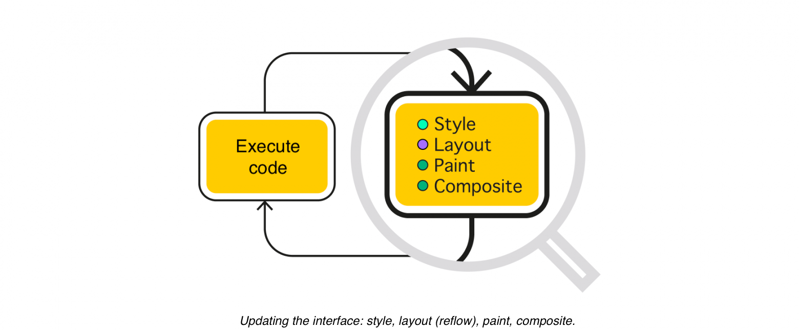
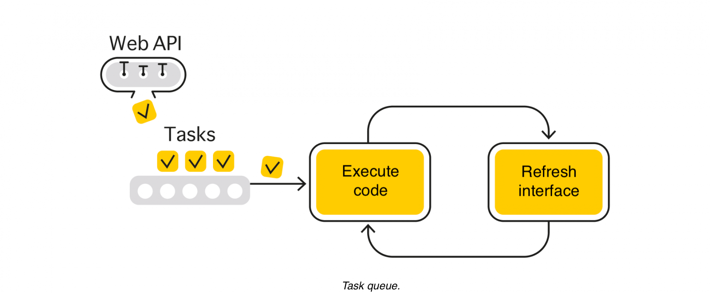
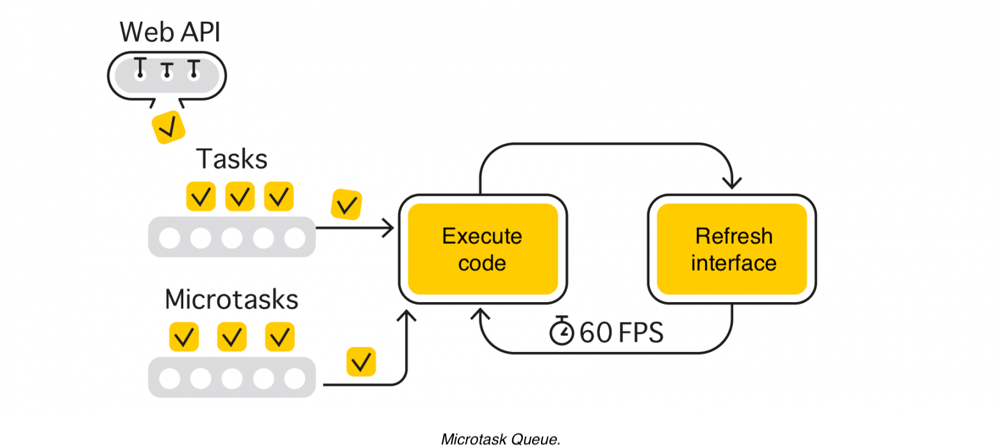

# Mastering Asynchrony in the Browser: A Comprehensive Guide

There are numerous articles, documentations, and books written about the asynchrony of JavaScript. 
However, the information is widely dispersed throughout the internet, making it difficult to quickly 
and fully understand what is what and to form a complete picture in your mind. 
What is lacking is a comprehensive guide. This is exactly the need that I want to meet with my article.


# Table of Contents
1. [Event Loop](#event-loop)
   1. [Tasks, Ticks, and Web API](#tasks-ticks-and-web-api)

## Event Loop
To run a website, the browser allocates a single thread that must simultaneously 
perform two important tasks: execute code and update the interface. However, 
a single thread can only perform one action at a time. Therefore, the thread performs 
these tasks sequentially to create the illusion of parallel execution. 
This is the event loop.


<figcaption align="center">
<i>Event Loop: Executing Code and Updating the Interface</i>
</figcaption>
<br/>


The call stack is where code execution takes place. When a function calls another function, its own execution is paused until the called function completes, forming a call stack. Once all the operations in the stack are executed and it becomes empty, the event loop can either add more code to the stack for execution or update the user interface.

<figcaption align="center">
<i>Call Stack</i>
</figcaption>
<br />


The browser engine is responsible for updating the user interface. This process usually consists of four steps: style, layout (reflow), paint, and composite. During the style step, the browser recalculates the style changes caused by JavaScript operations and calculates media queries. Layout recalculates the page's geometry, which involves computing layers, calculating the mutual arrangement of elements, and their mutual influence. During the paint step, the engine renders the elements and applies styles that only affect their appearance, such as color, background, etc. Composite applies the remaining specific styles, usually transformations that occur in a separate layer.

To optimize a web page, it can be helpful to understand when the browser performs or skips certain operations. The browser may skip unnecessary operations to improve performance. By understanding when the browser skips or executes specific steps, you can optimize your web page accordingly.


<figcaption align="center">
<i>Updating the interface: style, layout (reflow), paint, composite.
</i>
</figcaption>
<br />

The first operation in the event loop can be either updating the interface or executing code. If a website uses a synchronous script tag, the engine will most likely execute it before rendering the first user interface frame. However, if we load scripts asynchronously using async or defer, there’s a high probability that the browser will render the user interface before loading JavaScript.

The asynchronous script loading option is more preferable because the initial bundle is usually quite large. Until it is fully executed, the user will see a white screen because the event loop will not be able to render the user interface. Even with asynchronous loading, it is recommended to split JavaScript code into separate bundles and load only the essentials first, because the event loop is very sequential: it fully executes all the code in the call stack and only then moves on to updating the interface. If there is too much code in the call stack, the interface will be updated with a significant delay. The user will have the impression that the site is lagging. If an infinite loop is written, the browser will keep executing the code over and over, and the interface update will never happen, so the page will simply freeze and stop responding to user actions.

The call stack will execute both the developer-written code and the default built-in code responsible for interacting with the page. Thanks to the built-in code, scrolling, selection, animations, and other features work, for which JavaScript might seem unnecessary. The call stack will execute built-in scripts even when JavaScript is disabled in the browser. For example, you can open an empty about:blank page without JavaScript, perform a few clicks, and see that the call stack has executed the code responsible for event handling.

<figcaption align="center">
<i>The event loop always has work to do, even when a site is written without JavaScript.</i>
</figcaption>
<br />

### Tasks, Ticks, and Web API

A task is JavaScript code that executes in the call stack. A tick is the execution of a task in the call stack. Web API refers to properties and methods in the global Window object.

Web API methods can work either synchronously or asynchronously: the former will execute in the current tick, while the latter will execute in one of the following ticks.

A good example of synchronous calls is the DOM manipulation:

```javascript
const button = document.createElement('button'); 
document.body.appendChild(button);
button.textContent = 'OK';
```

Creating an element, inserting it into the DOM, and setting properties are synchronous operations that execute in the current tick. Therefore, it doesn’t matter when we set the text for the button - before inserting it into the DOM or after. The browser will update the interface only after completing all synchronous operations, so the user will immediately see the up-to-date interface state.

When we write asynchronous code, we ensure that the task will be executed in the next tick. It can start either before or after the interface is updated. For example, when the event loop needs to perform the next task, it can either execute it immediately after the previous one or update the interface first and then execute the next task. This distinction is not particularly important for developers. It’s essential to understand that an asynchronous task will be executed at some point in the future.

A good example of an asynchronous call is requesting data from a server. A callback function describes a task that will be executed at some point in the future after receiving the data:

```javascript
fetch('/url').then((response) => { 
    // will be executed at some point in the future 
})
```

The browser subsystem responsible for network operations will execute the request in a separate thread, working independently. While the request is being processed in the background, the event loop can update the interface and execute code. Once the data has been successfully loaded, the task we described through the callback function will be ready to execute in one of the following ticks of our main task cycle.

There may be multiple tasks ready for execution after asynchronous calls. Therefore, a special queue exists to transfer them to the call stack for execution.

### Task Queue

Tasks enter the queue through the asynchronous browser API. First, an asynchronous operation is performed somewhere in a separate thread, and after its completion, a task ready for execution is added to the call stack.


<figcaption align="center">
<i>Task queue.</i>
</figcaption>
<br />

Understanding this concept, one can examine a peculiarity of timers in JavaScript, which are also part of the asynchronous API.

```javascript
setTimeout(() => { 
    // enqueue a task after 1000 ms 
}, 1000)
```

When we start a timer, the engine begins counting down in a separate thread, and upon readiness, the task is added to the queue. One might think that the timer will execute after one second, but in reality, this is not the case. In the best-case scenario, it will be added to the task queue after one second, and the code will only be executed after the queue reaches it.

The same principle applies to event handlers. Each time we register an event handler, we attach a task to it, which will be added to the queue after the event occurs:

```javascript
document.body.addEventListener('click', () => { 
    // enqueue a task when the event occurs 
})
```

### 16.6 milliseconds per task

To make websites fast and responsive, the browser needs to create the illusion that it is simultaneously executing user code and updating the interface. However, since the event loop operates strictly sequentially, the browser has to quickly switch between tasks so the user doesn’t notice anything.

Typically, monitors refresh the image at a rate of 60 frames per second, so the event loop tries to execute code and update the interface at the same speed, which means a task takes 16.6 milliseconds to complete. If our code runs faster, the browser will simply update the display more frequently. But if the code runs slowly, the frame rate will start to decrease, and the user will feel like the website is lagging.

For most scenarios, 16.6 milliseconds is quite sufficient. However, sometimes heavy computations are required on the client side, which may take much more time. There are special techniques for such cases.

### Handling large tasks

There are two ways to optimize large tasks: either by breaking them down into subtasks and executing them in different ticks, or by moving the computation to a separate thread.

To execute something in the next tick, for example, [you can use setTimeout with a minimal delay](https://javascript.info/settimeout-setinterval#zero-delay-settimeout).

```javascript
function longTask() {
    toDoSomethingFirst()

    setTimeout(() => {
        toDoSomethingLater()
    }, 0)
}
```
There is also an experimental function called [postTask](https://developer.mozilla.org/en-US/docs/Web/API/Scheduler/postTask), which is part of the [Scheduling API](https://developer.mozilla.org/en-US/docs/Web/API/Prioritized_Task_Scheduling_API) and currently only available in [Chrome and Edge](https://caniuse.com/?search=postTask). It allows you not only to execute tasks asynchronously to unload the main thread but also to set priorities for them. You can read more about this in Jeremy Wagner’s article [“Optimize long tasks”](https://web.dev/optimize-long-tasks/).

To launch a separate thread, you can use the [Web Worker API](https://developer.mozilla.org/en-US/docs/Web/API/Worker):

```javascript
const worker = new Worker('worker.js')

worker.addEventListener('message', () => {
    // receive data
})

// send data
worker.postMessage('any data')
```

A separate thread is created for the web worker, where calculations will take place independently of the main event loop. Once the calculations are completed, the worker can send data to the main event loop using postMessage, and the task associated with processing the data will be added to the queue and executed in one of the following ticks. However, web workers have limitations. For example, you cannot work with the DOM inside a worker, but computational tasks will work.

If the calculation data is needed within other tabs from the same origin, you can use a SharedWorker instead of a regular worker. Additionally, for some tasks, a ServiceWorker might be useful, but that’s another story. You can read more about workers, for example, [here](https://dev.to/jennieji/introduction-to-workers-and-why-we-should-use-them-3mn3).

Aside from web workers, there is another, less obvious way to create a separate thread – opening a window or frame on a different domain to violate the same-origin policy. Then the window or frame will have its own independent event loop, which can perform some work and interact with the main window, just like a web worker, using the postMessage mechanism. This is quite a specific behavior that may look different in different browsers. You can test it, for example, using a [demo from Stack Overflow](https://stackoverflow.com/questions/11510483/will-a-browser-give-an-iframe-a-separate-thread-for-javascript).

### Microtasks

Microtasks are tasks that are stored in a special separate queue.

<figcaption align="center">
<i>Microtask Queue.</i>
</figcaption>
<br />

Tasks enter this queue when using promises, asynchronous functions, built-in calls to queueMicrotask, or Observer APIs.

```javascript
Promise.resolve().then(() => {
    // microtask
})

async function() {
    // microtask
}

queueMicrotask(() => {
    // microtask
})

new MutationObserver(() => {
    // microtask
}).observe(document.body, { childList: true, subtree: true })
```

The microtask queue has higher priority, and tasks from it are executed before regular tasks. Moreover, it has an important feature – the event loop will execute microtasks until the queue is empty. Thanks to this, the engine guarantees that all tasks in the queue have access to the same DOM state.

This behavior can be clearly seen in the example with promises, where each subsequent handler has access to the same DOM state (at the time of setting the promise):

```javascript
const div = document.createElement('div')
document.body.appendChild(div)

let height = 0

function changeDOM() {
    height += 1
    div.style.height = `${height}px`
    requestAnimationFrame(changeDOM)
}

requestAnimationFrame(changeDOM)

setTimeout(() => {
    const promise = Promise.resolve()
        .then(() => {
            console.log(div.style.height)
        })
        .then(() => {
            console.log(div.style.height)
        })

    promise
        .then(() => {
            console.log(div.style.height)
        })
}, 1000)

// all console.log will output the same value
```

There is a wonderful visual site, [JavaScript Visualizer 9000](https://www.jsv9000.app/), where you can explore in more detail how task queues and microtask queues work. 
Additionally, I recommend a good article [JavaScript Visualized: Promises & Async/Await](https://dev.to/lydiahallie/javascript-visualized-promises-async-await-5gke) that explains promises.

### requestAnimationFrame

requestAnimationFrame (or abbreviated as rAF) allows you to execute JavaScript code right before updating the interface. Emulating such behavior with other methods, like timers, is almost impossible.

<figcaption align="center">
<i>At the top without rAF, at the bottom with rAF</i>
</figcaption>
<br />

The main purpose of requestAnimationFrame is to provide smooth JavaScript animations, but it is not often used since animations are easier and more efficient to implement with CSS. Nevertheless, it occupies its own rightful place in the event loop.

There may be multiple tasks that need to be executed before updating the next frame, so requestAnimationFrame has its own separate queue.

<figcaption align="center">
<i>requestAnimationFrame</i>
</figcaption>
<br />
Tasks from the queue are executed once before updating the interface in the order they were added:

```javascript
requestAnimationFrame(() => {
    console.log('one')
})

requestAnimationFrame(() => {
    console.log('two')
})

requestAnimationFrame(() => {
    console.log('three')
})

// one two three
```

You can create a recurring task that will execute again and again using a recursive function. Moreover, if you need to cancel the execution for some reason, you can do it using cancelAnimationFrame. However, make sure to pass the current identifier to it, as each rAF call creates a new requestId.
```javascript
let requestId

function animate() {
    requestId = requestAnimationFrame(animate)
}

requestId = requestAnimationFrame(animate)

setTimeout(() => {
    // cancel animations after some time
    cancelAnimationFrame(requestId)
}, 3000)
```
There is [a small but useful article](https://flaviocopes.com/requestanimationframe/) on the topic of requestAnimationFrame in Flavio Copes’ blog.

### requestIdleCallback

requestIdleCallback (or abbreviated as rIC) adds tasks to yet another (fourth) queue, which will be executed during the browser’s idle period when there are no more priority tasks from other queues.

```javascript
function sendAnalytics() { 
    // send data for analytics 
}

requestIdleCallback(sendAnalytics, { timeout: 2000 });
```


As a second argument, you can specify a timeout, and if the task is not completed within the specified number of milliseconds, it will be added to the regular queue and then executed in the order of the general queue.

Similar to requestAnimationFrame, to regularly add a task to the queue, you will need to write a recursive function, and to stop it - pass the current identifier to cancelIdleCallback.


<figcaption align="center">
<i>requestAnimationFrame</i>
</figcaption>
<br />

In contrast to the other queues discussed earlier, requestIdleCallback is still partly an experimental API, with support [missing in Safari](https://caniuse.com/?search=cancelIdleCallback). In addition, this function has a [number of limitations](https://developer.mozilla.org/en-US/docs/Web/API/Background_Tasks_API#getting_the_most_out_of_idle_callbacks), making it convenient to use only for small non-priority tasks without interaction with the DOM, for example, for sending analytical data. You can read more about requestIdleCallback in Paul Lewis’s material [“Using requestIdleCallback”](https://developer.chrome.com/blog/using-requestidlecallback/).

### Comparison of queues

**The microtask queue** is the highest priority queue, with code execution starting from it. The browser continues to work with this queue until there are tasks in it, no matter how long it takes.

From the **task queue**, the engine usually executes one or several tasks, trying to fit within 16.6 milliseconds. As soon as the allotted time passes, the engine will go to update the interface, even if there are tasks left in the queue. It will return to them on the next loop of the event cycle.

**requestAnimation** will execute all tasks from its queue because it guarantees code execution before updating the interface. However, if someone adds new tasks to the queue during execution, they will be performed on the next loop.

When the idle time comes and there are no more priority tasks in other queues, one or several requestIdleCallback tasks will be executed. Thus, this queue is somewhat similar to the task queue but with a lower priority.

Interaction with queues occurs through:

 - tasks - timers, events (including postMessage processing); 
 - microtasks - promises, asynchronous functions, Observer API, queueMicrotask; 
 - requestAnimationFrame, requestIdleCallback - corresponding API calls.

### Event loop in Node.js

In Node.js, the event loop works in a similar way: first, a task is executed, then you need to look into the queue for the next one. However, the set of queues is different, and there are no stages related to updating the interface because the code runs on the server. You can read more about event loops in Node.js in a [series of articles written by Deepal Jayasekara](https://blog.insiderattack.net/event-loop-and-the-big-picture-nodejs-event-loop-part-1-1cb67a182810). For a quick understanding of `setImmediate` and `process.nextTick`, there is a [good explanation on Stack Overflow](https://stackoverflow.com/questions/55467033/difference-between-process-nexttick-and-queuemicrotask/57325561#57325561).


Used resources:
- https://stackoverflow.com/questions/11948245/markdown-to-create-pages-and-table-of-contents
