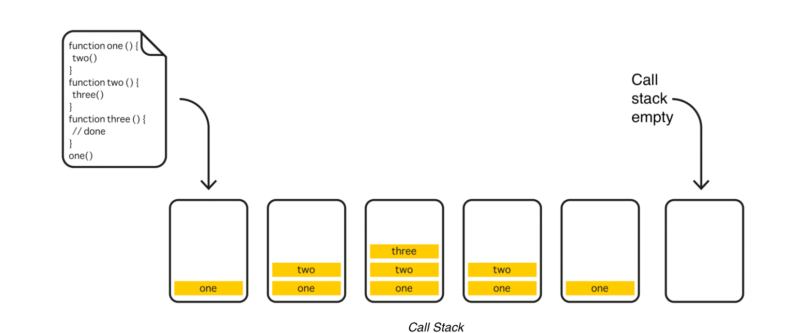

# Mastering Asynchrony in the Browser: A Comprehensive Guide

> Acknowledgements 
> 
> This article was originally written in Russian by [Grigory Biziukin](https://habr.com/ru/users/gbiz/posts/) and was published on [Полное понимание асинхронности в браузере
](https://habr.com/ru/companies/yandex/articles/718084/) on 28/02/2023. I would like to thank [Grigory Biziukin](https://habr.com/ru/users/gbiz/posts/) for creating such informative and insightful content.
> I have made every effort to accurately translate the content while maintaining the author's original message and intent. However, any errors in translation are solely my own.
> I hope that my translation will allow a wider audience to access and appreciate this valuable content, and I encourage readers to visit the original publication or website to read more of [Grigory Biziukin](https://habr.com/ru/users/gbiz/posts/)'s work.


There are numerous articles, documentations, and books written about the asynchrony of JavaScript. 
However, the information is widely dispersed throughout the internet, making it difficult to quickly 
and fully understand what is what and to form a complete picture in your mind. 
What is lacking is a comprehensive guide. This is exactly the need that I want to meet with my article.


# Table of Contents
1. [Event Loop](#event-loop)
   1. [Tasks, Ticks, and Web API](#tasks-ticks-and-web-api)
   2. [Task Queue](#task-queue)
   3. [16.6 milliseconds per task](#166-milliseconds-per-task)
   4. [Handling large tasks](#handling-large-tasks)
   5. [Microtasks](#microtasks)
   6. [requestAnimationFrame](#requestanimationframe)
   7. [requestIdleCallback](#requestidlecallback)
   8. [Comparison of queues](#comparison-of-queues)
   9. [Event loop in Node.js](#event-loop-in-nodejs)
2. [Callback Functions](#callback-functions)
   1. [Callback Hell](#callback-hell)
   2. [Don't Release Zalgo](#dont-release-zalgo)
   3. [Tight Coupling](#tight-coupling)
   4. [The Trust Issue](#the-trust-issue)
3. [Promises](#promises)
   1. [Promise chains and error propagation](#promise-chains-and-error-propagation)
   2. [Implicit behavior](#implicit-behavior)
      1. [Returning a new promise](#returning-a-new-promise)
      2. [Hidden try/catch](#hidden-trycatch)
   3. [Thenable objects](#thenable-objects)
   4. [Static methods](#static-methods)
      1. [Promise.all](#promiseall)
      2. [Promise.race](#promiserace)
      3. [Promise.any](#promiseany)
      4. [Promise.allSettled](#promiseallsettled)
   5. [Promisification](#promisification)
   6. [Promises or callback functions?](#promises-or-callback-functions)
   7. [Coroutines](#coroutines)
4. [Async/await](#asyncawait)
   1. [Top-level await and asynchronous modules](#top-level-await-and-asynchronous-modules)
   2. [Error handling](#error-handling)
   3. [Not all await is equally useful](#not-all-await-is-equally-useful)
5. [Conclusion](#conclusion)
## Event Loop
To run a website, the browser allocates a single thread that must simultaneously 
perform two important tasks: execute code and update the interface. However, 
a single thread can only perform one action at a time. Therefore, the thread performs 
these tasks sequentially to create the illusion of parallel execution. 
This is the event loop.


<figcaption align="center">
<i>Event Loop: Executing Code and Updating the Interface</i>
</figcaption>


The call stack is where code execution takes place. When a function calls another function, its own execution is paused until the called function completes, forming a call stack. Once all the operations in the stack are executed and it becomes empty, the event loop can either add more code to the stack for execution or update the user interface.

<figcaption align="center">
<i>Call Stack</i>
</figcaption>
<br />


The browser engine is responsible for updating the user interface. This process usually consists of four steps: style, layout (reflow), paint, and composite. During the style step, the browser recalculates the style changes caused by JavaScript operations and calculates media queries. Layout recalculates the page's geometry, which involves computing layers, calculating the mutual arrangement of elements, and their mutual influence. During the paint step, the engine renders the elements and applies styles that only affect their appearance, such as color, background, etc. Composite applies the remaining specific styles, usually transformations that occur in a separate layer.

To optimize a web page, it can be helpful to understand when the browser performs or skips certain operations. The browser may skip unnecessary operations to improve performance. By understanding when the browser skips or executes specific steps, you can optimize your web page accordingly.


<figcaption align="center">
<i>Updating the interface: style, layout (reflow), paint, composite.
</i>
</figcaption>
<br />

The first operation in the event loop can be either updating the interface or executing code. If a website uses a synchronous script tag, the engine will most likely execute it before rendering the first user interface frame. However, if we load scripts asynchronously using async or defer, there’s a high probability that the browser will render the user interface before loading JavaScript.

The asynchronous script loading option is more preferable because the initial bundle is usually quite large. Until it is fully executed, the user will see a white screen because the event loop will not be able to render the user interface. Even with asynchronous loading, it is recommended to split JavaScript code into separate bundles and load only the essentials first, because the event loop is very sequential: it fully executes all the code in the call stack and only then moves on to updating the interface. If there is too much code in the call stack, the interface will be updated with a significant delay. The user will have the impression that the site is lagging. If an infinite loop is written, the browser will keep executing the code over and over, and the interface update will never happen, so the page will simply freeze and stop responding to user actions.

The call stack will execute both the developer-written code and the default built-in code responsible for interacting with the page. Thanks to the built-in code, scrolling, selection, animations, and other features work, for which JavaScript might seem unnecessary. The call stack will execute built-in scripts even when JavaScript is disabled in the browser. For example, you can open an empty about:blank page without JavaScript, perform a few clicks, and see that the call stack has executed the code responsible for event handling.

<figcaption align="center">
<i>The event loop always has work to do, even when a site is written without JavaScript.</i>
</figcaption>
<br />


### Tasks, Ticks, and Web API

A task is JavaScript code that executes in the call stack. A tick is the execution of a task in the call stack. Web API refers to properties and methods in the global Window object.

Web API methods can work either synchronously or asynchronously: the former will execute in the current tick, while the latter will execute in one of the following ticks.

A good example of synchronous calls is the DOM manipulation:

```javascript
const button = document.createElement('button'); 
document.body.appendChild(button);
button.textContent = 'OK';
```

Creating an element, inserting it into the DOM, and setting properties are synchronous operations that execute in the current tick. Therefore, it doesn’t matter when we set the text for the button - before inserting it into the DOM or after. The browser will update the interface only after completing all synchronous operations, so the user will immediately see the up-to-date interface state.

When we write asynchronous code, we ensure that the task will be executed in the next tick. It can start either before or after the interface is updated. For example, when the event loop needs to perform the next task, it can either execute it immediately after the previous one or update the interface first and then execute the next task. This distinction is not particularly important for developers. It’s essential to understand that an asynchronous task will be executed at some point in the future.

A good example of an asynchronous call is requesting data from a server. A callback function describes a task that will be executed at some point in the future after receiving the data:

```javascript
fetch('/url').then((response) => { 
    // will be executed at some point in the future 
})
```

The browser subsystem responsible for network operations will execute the request in a separate thread, working independently. While the request is being processed in the background, the event loop can update the interface and execute code. Once the data has been successfully loaded, the task we described through the callback function will be ready to execute in one of the following ticks of our main task cycle.

There may be multiple tasks ready for execution after asynchronous calls. Therefore, a special queue exists to transfer them to the call stack for execution.


### Task Queue

Tasks enter the queue through the asynchronous browser API. First, an asynchronous operation is performed somewhere in a separate thread, and after its completion, a task ready for execution is added to the call stack.


<figcaption align="center">
<i>Task queue.</i>
</figcaption>
<br />

Understanding this concept, one can examine a peculiarity of timers in JavaScript, which are also part of the asynchronous API.

```javascript
setTimeout(() => { 
    // enqueue a task after 1000 ms 
}, 1000)
```

When we start a timer, the engine begins counting down in a separate thread, and upon readiness, the task is added to the queue. One might think that the timer will execute after one second, but in reality, this is not the case. In the best-case scenario, it will be added to the task queue after one second, and the code will only be executed after the queue reaches it.

The same principle applies to event handlers. Each time we register an event handler, we attach a task to it, which will be added to the queue after the event occurs:

```javascript
document.body.addEventListener('click', () => { 
    // enqueue a task when the event occurs 
})
```


### 16.6 milliseconds per task

To make websites fast and responsive, the browser needs to create the illusion that it is simultaneously executing user code and updating the interface. However, since the event loop operates strictly sequentially, the browser has to quickly switch between tasks so the user doesn’t notice anything.

Typically, monitors refresh the image at a rate of 60 frames per second, so the event loop tries to execute code and update the interface at the same speed, which means a task takes 16.6 milliseconds to complete. If our code runs faster, the browser will simply update the display more frequently. But if the code runs slowly, the frame rate will start to decrease, and the user will feel like the website is lagging.

For most scenarios, 16.6 milliseconds is quite sufficient. However, sometimes heavy computations are required on the client side, which may take much more time. There are special techniques for such cases.


### Handling large tasks

There are two ways to optimize large tasks: either by breaking them down into subtasks and executing them in different ticks, or by moving the computation to a separate thread.

To execute something in the next tick, for example, [you can use setTimeout with a minimal delay](https://javascript.info/settimeout-setinterval#zero-delay-settimeout).

```javascript
function longTask() {
    toDoSomethingFirst()

    setTimeout(() => {
        toDoSomethingLater()
    }, 0)
}
```
There is also an experimental function called [postTask](https://developer.mozilla.org/en-US/docs/Web/API/Scheduler/postTask), which is part of the [Scheduling API](https://developer.mozilla.org/en-US/docs/Web/API/Prioritized_Task_Scheduling_API) and currently only available in [Chrome and Edge](https://caniuse.com/?search=postTask). It allows you not only to execute tasks asynchronously to unload the main thread but also to set priorities for them. You can read more about this in Jeremy Wagner’s article [“Optimize long tasks”](https://web.dev/optimize-long-tasks/).

To launch a separate thread, you can use the [Web Worker API](https://developer.mozilla.org/en-US/docs/Web/API/Worker):

```javascript
const worker = new Worker('worker.js')

worker.addEventListener('message', () => {
    // receive data
})

// send data
worker.postMessage('any data')
```

A separate thread is created for the web worker, where calculations will take place independently of the main event loop. Once the calculations are completed, the worker can send data to the main event loop using postMessage, and the task associated with processing the data will be added to the queue and executed in one of the following ticks. However, web workers have limitations. For example, you cannot work with the DOM inside a worker, but computational tasks will work.

If the calculation data is needed within other tabs from the same origin, you can use a SharedWorker instead of a regular worker. Additionally, for some tasks, a ServiceWorker might be useful, but that’s another story. You can read more about workers, for example, [here](https://dev.to/jennieji/introduction-to-workers-and-why-we-should-use-them-3mn3).

Aside from web workers, there is another, less obvious way to create a separate thread – opening a window or frame on a different domain to violate the same-origin policy. Then the window or frame will have its own independent event loop, which can perform some work and interact with the main window, just like a web worker, using the postMessage mechanism. This is quite a specific behavior that may look different in different browsers. You can test it, for example, using a [demo from Stack Overflow](https://stackoverflow.com/questions/11510483/will-a-browser-give-an-iframe-a-separate-thread-for-javascript).


### Microtasks

Microtasks are tasks that are stored in a special separate queue.

<figcaption align="center">
<i>Microtask Queue.</i>
</figcaption>
<br />

Tasks enter this queue when using promises, asynchronous functions, built-in calls to queueMicrotask, or Observer APIs.

```javascript
Promise.resolve().then(() => {
    // microtask
})

async function() {
    // microtask
}

queueMicrotask(() => {
    // microtask
})

new MutationObserver(() => {
    // microtask
}).observe(document.body, { childList: true, subtree: true })
```

The microtask queue has higher priority, and tasks from it are executed before regular tasks. Moreover, it has an important feature – the event loop will execute microtasks until the queue is empty. Thanks to this, the engine guarantees that all tasks in the queue have access to the same DOM state.

This behavior can be clearly seen in the example with promises, where each subsequent handler has access to the same DOM state (at the time of setting the promise):

```javascript
const div = document.createElement('div')
document.body.appendChild(div)

let height = 0

function changeDOM() {
    height += 1
    div.style.height = `${height}px`
    requestAnimationFrame(changeDOM)
}

requestAnimationFrame(changeDOM)

setTimeout(() => {
    const promise = Promise.resolve()
        .then(() => {
            console.log(div.style.height)
        })
        .then(() => {
            console.log(div.style.height)
        })

    promise
        .then(() => {
            console.log(div.style.height)
        })
}, 1000)

// all console.log will output the same value
```

There is a wonderful visual site, [JavaScript Visualizer 9000](https://www.jsv9000.app/), where you can explore in more detail how task queues and microtask queues work. 
Additionally, I recommend a good article [JavaScript Visualized: Promises & Async/Await](https://dev.to/lydiahallie/javascript-visualized-promises-async-await-5gke) that explains promises.

### requestAnimationFrame

requestAnimationFrame (or abbreviated as rAF) allows you to execute JavaScript code right before updating the interface. Emulating such behavior with other methods, like timers, is almost impossible.

<figcaption align="center">
<i>At the top without rAF, at the bottom with rAF</i>
</figcaption>
<br />

The main purpose of requestAnimationFrame is to provide smooth JavaScript animations, but it is not often used since animations are easier and more efficient to implement with CSS. Nevertheless, it occupies its own rightful place in the event loop.

There may be multiple tasks that need to be executed before updating the next frame, so requestAnimationFrame has its own separate queue.

<figcaption align="center">
<i>requestAnimationFrame</i>
</figcaption>
<br />
Tasks from the queue are executed once before updating the interface in the order they were added:

```javascript
requestAnimationFrame(() => {
    console.log('one')
})

requestAnimationFrame(() => {
    console.log('two')
})

requestAnimationFrame(() => {
    console.log('three')
})

// one two three
```

You can create a recurring task that will execute again and again using a recursive function. Moreover, if you need to cancel the execution for some reason, you can do it using cancelAnimationFrame. However, make sure to pass the current identifier to it, as each rAF call creates a new requestId.
```javascript
let requestId

function animate() {
    requestId = requestAnimationFrame(animate)
}

requestId = requestAnimationFrame(animate)

setTimeout(() => {
    // cancel animations after some time
    cancelAnimationFrame(requestId)
}, 3000)
```
There is [a small but useful article](https://flaviocopes.com/requestanimationframe/) on the topic of requestAnimationFrame in Flavio Copes’ blog.


### requestIdleCallback

requestIdleCallback (or abbreviated as rIC) adds tasks to yet another (fourth) queue, which will be executed during the browser’s idle period when there are no more priority tasks from other queues.

```javascript
function sendAnalytics() { 
    // send data for analytics 
}

requestIdleCallback(sendAnalytics, { timeout: 2000 });
```


As a second argument, you can specify a timeout, and if the task is not completed within the specified number of milliseconds, it will be added to the regular queue and then executed in the order of the general queue.

Similar to requestAnimationFrame, to regularly add a task to the queue, you will need to write a recursive function, and to stop it - pass the current identifier to cancelIdleCallback.


<figcaption align="center">
<i>requestAnimationFrame</i>
</figcaption>
<br />

In contrast to the other queues discussed earlier, requestIdleCallback is still partly an experimental API, with support [missing in Safari](https://caniuse.com/?search=cancelIdleCallback). In addition, this function has a [number of limitations](https://developer.mozilla.org/en-US/docs/Web/API/Background_Tasks_API#getting_the_most_out_of_idle_callbacks), making it convenient to use only for small non-priority tasks without interaction with the DOM, for example, for sending analytical data. You can read more about requestIdleCallback in Paul Lewis’s material [“Using requestIdleCallback”](https://developer.chrome.com/blog/using-requestidlecallback/).


### Comparison of queues 

**The microtask queue** is the highest priority queue, with code execution starting from it. The browser continues to work with this queue until there are tasks in it, no matter how long it takes.

From the **task queue**, the engine usually executes one or several tasks, trying to fit within 16.6 milliseconds. As soon as the allotted time passes, the engine will go to update the interface, even if there are tasks left in the queue. It will return to them on the next loop of the event cycle.

**requestAnimation** will execute all tasks from its queue because it guarantees code execution before updating the interface. However, if someone adds new tasks to the queue during execution, they will be performed on the next loop.

When the idle time comes and there are no more priority tasks in other queues, one or several requestIdleCallback tasks will be executed. Thus, this queue is somewhat similar to the task queue but with a lower priority.

Interaction with queues occurs through:

 - tasks - timers, events (including postMessage processing); 
 - microtasks - promises, asynchronous functions, Observer API, queueMicrotask; 
 - requestAnimationFrame, requestIdleCallback - corresponding API calls.


### Event loop in Node.js

In Node.js, the event loop works in a similar way: first, a task is executed, then you need to look into the queue for the next one. However, the set of queues is different, and there are no stages related to updating the interface because the code runs on the server. You can read more about event loops in Node.js in a [series of articles written by Deepal Jayasekara](https://blog.insiderattack.net/event-loop-and-the-big-picture-nodejs-event-loop-part-1-1cb67a182810). For a quick understanding of `setImmediate` and `process.nextTick`, there is a [good explanation on Stack Overflow](https://stackoverflow.com/questions/55467033/difference-between-process-nexttick-and-queuemicrotask/57325561#57325561).

> Translator's notice:
> There's a really good video which explains how the event loop works here: [What the heck is the event loop anyway? | Philip Roberts | JSConf EU
](https://www.youtube.com/watch?v=8aGhZQkoFbQ)


## Callback Functions

This is a convenient and simple way to interact with asynchronous APIs, but if not handled carefully, many problems can arise.

### Callback Hell

**Callback hell** is the most common issue mentioned when discussing the drawbacks of callback functions.

The sequence of asynchronous calls using callback functions becomes similar to the **pyramid of doom**.

```javascript
fetchToken(url, (token) => {
    fetchUser(token, (user) => {
        fetchRole(user, (role) => {
            fetchAccess(role, (access) => {
                fetchReport(access, (report) => {
                    fetchContent(report, (content) => {
                        // Welcome to Callback Hell
                    })
                })
            })
        })
    })
})
```
One might think that this is the main drawback of callback functions, but the problems with them are just beginning.

### Don't Release Zalgo

The thing is, you can't initially determine how exactly a callback function will be called—synchronously or asynchronously, and the logic of our code can strongly depend on this. To be sure, you will have to read the implementation of the function. This requires additional actions and complicates debugging.

```javascript
syncOrAsync(() => {
// how is the code executed?
})

// synchronous implementation
function syncOrAsync(callback) {
    callback()
}

// asynchronous implementation
function syncOrAsync(callback) {
    queueMicrotask(callback)
}
```
In niche circles, this problem is widely known as the Zalgo monster issue, which is better not to release.

### Tight Coupling

Tight coupling is the issue of one part of the code depending on another when handling sequential asynchronous operations:
```javascript
firstStep((error, data) => {
   if (error) {
       // cancel step #1
   }
   secondStep((error, data) => {
      if (error) {
          // cancel step #2, then #1
      }
   })
})
```

If an error occurs in step #1, only it needs to be handled. But if an error occurs in step #2, you'll have to cancel step #2 and then step #1 as well. The more steps there are, the more problems there will be when handling errors.

### The Trust Issue

Inversion of control is passing our code to a library written by other developers:

```javascript
import { thirdPartyCode } from 'third-party-package'

thirdPartyCode(() => {
    // inversion of control
})
```

We rely on our task being called as it should, but everything may not go as expected. Another library might call the function too early or too late, do it too frequently or rarely, swallow errors and exceptions, pass incorrect arguments, or not call our function at all.

Based on what's been said, one might think that working with asynchrony through callback functions is full of challenges. To some extent, that's true, but fortunately, **promises** help to deal with all these problems.


## Promises

Promises are like order numbers at a restaurant. When we place an order, instead of food, we receive an order number. There are two possible scenarios: first, the order will be successfully prepared and served at the pick-up counter after some time; second, something could go wrong, such as running out of ingredients, and the restaurant employee will inform us that they cannot fulfill our order and will offer a refund or an alternative.

Promises are created through the Promise constructor, which must be called with new. The constructor takes only one argument: a callback function with two parameters, resolve and reject. Inside the Promise, an asynchronous operation is performed with the callback function. In turn, inside this function, either resolve or reject is called, setting the Promise to either a fulfilled or rejected state, respectively.

This is how a Promise can be set to either fulfilled or rejected:

```javascript
// set Promise to fulfilled
const resolvedPromise = new Promise((resolve, reject) => {
    setTimeout(() => { resolve('^_^') }, 1000)
})

// set Promise to rejected
const rejectedPromise = new Promise((resolve, reject) => {
    setTimeout(() => { reject('O_o') }, 1000)
})
```
After a Promise is set, the result can be obtained through the then method:

```javascript
resolvedPromise.then((value) => {
    console.log(value) // ^_^
})
```
A rejection can be handled either through the second parameter in then or through catch:

```javascript
rejectedPromise.then(
   (value) => {
       // ... ignored
   },
   (error) => {
       console.log(error) // O_o
   }
)

rejectedPromise.catch((error) => {
    console.log(error) // O_o
})
```

The value of a Promise is set once and cannot be changed:

```javascript
const promise = new Promise((resolve, reject) => {
   resolve('^_^')
   reject('O_o') // will not affect the state of the Promise
})

promise.then((value) => {
    console.log(value) // ^_^
})

promise.then((value) => {
    console.log(value) // ^_^
})
```

For convenience, you can use the static methods, the Promise.resolve and Promise.reject constructor functions, which create an already-set Promise:
```javascript
Promise.resolve('^^').then((value) => {
    console.log(value) // ^^
})

Promise.reject('O_o').catch((error) => {
    console.log(error) // O_o
})
```
Promises also have a finally method, which does something regardless of success or failure. This is similar to baking a dish in an oven: whether the dish burns or not, the oven still needs to be turned off.
```javascript
Promise.resolve('^^').finally(() => {
    // do something
}).then((value) => {
    console.log(value) // ^^
})

Promise.reject('O_o').finally(() => {
    // do something
}).catch((error) => {
    console.log(error) // O_o
})
```

### Promise chains and error propagation

The main benefit of promises is that we can build chains of asynchronous operations with them:

```javascript
Promise.resolve('^')
    .then((value) => {
        return value + '_'
    })
    .then((value) => {
        return value + '^'
    })
    .then((value) => {
        console.log(value) // ^_^
    })
```

If an error occurs somewhere, the rejection will skip the fulfillment handlers and reach the nearest rejection handler, after which the chain will continue to operate normally:
```javascript
Promise.resolve()
   .then(() => {
       return Promise.reject('O_o')
   })
   .then(() => {
       // all fulfillment handlers will be skipped
   })
   .catch((error) => {
       console.log(error) // O_o
   })
   .then(() => {
       // continue to execute the chain normally
   })
```
You can also return a value inside catch, and it will be processed in the chain just the same:

```javascript
Promise.reject('O_o')
    .catch((error) => {
        console.log(error) // O_o
        return '^_^'
    })
    .then((value) => {
        console.log(value) // ^_^
    })
```
If the chain ends and the error remains unhandled, the unhandledPromiseRejection event will be triggered, which you can subscribe to in order to track unhandled errors inside promises:
```javascript
window.addEventListener('unhandledrejection', (event) => {
   console.log('Unhandled Promise error. Shame on you!')
   console.log(event) // PromiseRejectionEvent
   console.log(event.reason) // O_o
})
```
It's important to understand that error handling only works when the chain is uninterrupted. If you omit the return statement and create a promise set to reject, the subsequent catch won't be able to handle it:
```javascript
Promise.resolve()
   .then(() => {
       Promise.reject('O_o')
   })
   .catch(() => {
      // will be skipped because return is not specified
      // UnhandledPromiseRejection will be thrown
   })
```

### Implicit behavior

Promises have two implicit features. First, the then and catch methods always return a new promise. Second, they internally catch any errors and, if something goes wrong, return a promise set to reject with the reason for the error.

#### Returning a new promise

Each call to then or catch creates a new promise, the value of which is either undefined or explicitly set via return.

Thanks to this, instead of creating temporary variables, you can immediately make a convenient chain of calls:

```javascript
// you can do it like this:
const one = Promise.resolve('^')

const two = one.then((value) => {
    return value + '_'
})

const three = two.then((value) => {
    return value + '^'
})

three.then((value) => {
    console.log(value) // ^_^
})

// but this is much better:
Promise.resolve('^')
   .then((value) => {
       return value + ''
   })
   .then((value) => {
       return value + '^'
   })
   .then((value) => {
       console.log(value) // ^^
   })
```

At the same time, if you return a promise, its value will be unwrapped, and everything will work exactly the same.
```javascript
Promise.resolve()
   .then(() => {
       return Promise.resolve('^^')
   })
   .then((value) => {
       console.log(value) // ^^
   })
```
Because of this, you can avoid nested promises and always write code with a single level of nesting:
```javascript
// you can do it like this:
Promise.resolve('^')
    .then((value) => {
        return Promise.resolve(value + '_')
            .then((value) => {
                return Promise.resolve(value + '^')
                    .then((value) => {
                        console.log(value) // ^_^
                    })
            })
    })

// but this is much better:
Promise.resolve('^')
    .then((value) => {
        return Promise.resolve(value + '_')
    })
    .then((value) => {
        return Promise.resolve(value + '^')
    })
    .then((value) => {
        console.log(value) // ^_^
    })
```

#### Hidden try/catch

Another feature of promises is related to error handling. Callback functions passed to promise methods are wrapped in try/catch. If something goes wrong, the try/catch will catch the error and set it as the reason for the promise's rejection:
```javascript
Promise.resolve()
.then(() => {
    undefined.toString()
})
.catch((error) => {
    console.log(error) // TypeError: Cannot read property 'toString' of undefined
})
```
This is the same as manually writing this code:

```javascript
Promise.resolve()
    .then(() => {
        try {
            undefined.toString()
        } catch (error) {
            return Promise.reject(error)
        }
    })
    .catch((error) => {
        console.log(error) // TypeError: Cannot read property 'toString' of undefined
    })
```
Thus, within promises, you can do without try/catch because promises will do it for us. The main thing is to properly handle the reason for rejection in catch.

### Thenable objects

These are objects that have a then method:

```javascript
const thenable = {
    then (fulfill) {
        fulfill('@_@')
    }
}
```
Most likely, these are promise polyfills before ES6. Promises will unwrap such objects and then wrap them in full-fledged ES6 promises. This is how resolve, Promise.resolve, then, and catch work.
```javascript
Promise.resolve(thenable)
    .then((value) => {
        console.log(value) // @_@
    })

new Promise((resolve) => {
    resolve(thenable)
}).then((value) => {
    console.log(value) // @_@
})

Promise.resolve()
    .then(() => {
        return thenable
    })
    .then((value) => {
        console.log(value) // @_@
    })
```
Thanks to this, compatibility with code written before ES6 is ensured:

```javascript
const awesomeES6Promise = Promise.resolve(thenable)
awesomeES6Promise.then((value) => {
    console.log(value) // @_@
})
```
There is one peculiarity: if you pass a regular promise to Promise.resolve, it will not be unwrapped and will be returned unchanged. At the same time, resolve, then, and catch will unwrap the value and create a new promise.

```javascript
const thenable = {
    then (fulfill) {
        fulfill('@_@')
    }
}

const promise = Promise.resolve('@_@')

const resolvedThenable = Promise.resolve(thenable)
const resolvedPromise = Promise.resolve(promise)

console.log(thenable === resolvedThenable) // false
console.log(promise === resolvedPromise) // true
```
But the most interesting part is the behavior of reject and Promise.reject, which work completely differently. If you pass any object to them, including a promise, they will simply return it as the reason for rejection:

```javascript
const promise = Promise.resolve('@_@')

Promise.reject(promise)
    .catch((value) => {
        console.log(value) // Promise {<fulfilled>: "@_@"}
    })
```

### Static methods

Promises have six useful static methods. We have already covered two of them - Promise.resolve and Promise.reject. Let's take a look at the other four.

For clarity, let's write a function that will help us get a settled promise after a certain time:
```javascript
const setPromise = (value, ms, isRejected = false) =>
    new Promise((resolve, reject) =>
        setTimeout(() => isRejected ? reject(value) : resolve(value), ms))
```
All four methods we will cover below accept an array of values. However, each of these methods works differently, and they return different results.

#### Promise.all

This call returns an array of values or the first rejection:

```javascript
Promise.all([
    setPromise('^_^', 400),
    setPromise('^_^', 200),
]).then((result) => {
    console.log(result) // [ "^_^", "^_^" ]
})
```
If at least one promise fails, instead of an array of values, the reason for rejection will be sent to catch:
```javascript
Promise.all([
    setPromise('^_^', 400),
    setPromise('O_o', 200, true),
]).catch((error) => {
    console.log(error) // O_o
})
```
For an empty array, an empty result is returned immediately:

```javascript
Promise.all([])
    .then((result) => {
        console.log(result) // []
    })
```

#### Promise.race

This method returns the first value or the first rejection:
```javascript
Promise.race([
    setPromise('^_^', 100),
    setPromise('O_o', 200, true),
]).then((result) => {
    console.log(result) // ^_^
})
```
If the rejection occurs first, then race will be set to rejection:

```javascript
Promise.race([
    setPromise('^_^', 400),
    setPromise('O_o', 200, true),
]).catch((error) => {
    console.log(error) // O_o
})
```

If you pass an empty array to Promise.race, the promise will be stuck in a pending state and will not be set to either fulfillment or rejection:

```javascript
Promise.race([])
    .then(() => {
        console.log('resolve не выполнится никогда')
    }).catch(() => {
        console.log('reject тоже')
    })
```

#### Promise.any

The call returns the first value or an array of rejection reasons if none of the promises were successful:

```javascript
Promise.any([
    setPromise('^_^', 400),
    setPromise('O_o', 200, true),
]).then((result) => {
    console.log(result) // ^_^
})
```
When all promises are set to rejection, any will return an error object, in which you can extract information about the rejections from the errors field:
```javascript
Promise.any([
    setPromise('O_o', 400, true),
    setPromise('O_o', 200, true),
]).catch((result) => {
    console.log(result.message) // All promises were rejected
    console.log(result.errors) // [ "O_o", "O_o" ]
})
```
For an empty array, an error will be returned:

```javascript
Promise.any([])
    .catch((error) => {
        console.log(error.message) // All promises were rejected
    })
```

#### Promise.allSettled

The method will wait for all promises to be completed and return an array of special objects:

```javascript
Promise.allSettled([
    setPromise('^_^', 400),
    setPromise('O_o', 200, true),
]).then(([resolved, rejected]) => {
    console.log(resolved) // { status: "fulfilled", value: "^_^" }
    console.log(rejected) // { status: "rejected", reason: "O_o" }
})
```

For an empty array, an empty result is: 

```javascript
Promise.allSettled([])
    .then((result) => {
        console.log(result) // []
    })
```

### Promisification

When you need to transition from callback functions to promises, promisification comes to the rescue - a special helper function that turns a function working with a callback into a function that returns a promise:

```javascript
function promisify (fn) {
    return function (...args) {
        return new Promise((resolve, reject) => {
            function callback(error, result) {
                return error ? reject(error) : resolve(result)
            }

            fn(...args, callback)
        })
    }
}

function asyncApi (url, callback) {
    // ... perform asynchronous operation
    callback(null, '^_^')
}

promisify(asyncApi)('/url')
    .then((result) => {
        console.log(result) // ^_^
    })
```

The operation of promisification depends on the signature of the functions in the code, because it requires considering the order of arguments, as well as the parameters of the callback. In the example above, it is assumed that the callback function is passed as the last argument, and it first takes an error as a parameter, followed by the result.

### Promises or callback functions?

Promises eliminate the drawbacks of callback functions. They are always asynchronous and one-time, the code is linear and does not have tight coupling, and you don't have to worry about callback hell.

But what if a promise gets stuck and is not being fulfilled or rejected? In this case, you can use Promise.race to interrupt the execution of a stuck or very long request by a timeout:

```javascript
Promise.race([
    fetchLongRequest(),
    new Promise((_, reject) => setTimeout(reject, 3000)),
]).then((result) => {
    // получили данные
}).catch((error) => {
    // или отказ по таймеру
})
```

In any case, it's important to understand: despite the many advantages of promises, you will still need to use callback functions in some places, and that's okay. Event handlers and many asynchronous API methods, such as setTimeout, work through them, so in such cases, there's no point in promisifying and it's more convenient to use callback functions. After all, we will also need them to create a promise. The main thing to remember is that if there is a chain of sequential calls somewhere, promises must be used there.

### Coroutines

Promises are the foundation for working with asynchrony, but there is a very convenient async/await extension built on top of this foundation, which is implemented thanks to coroutines.

A coroutine (cooperative concurrently executed routine) is a co-program or, in simpler terms, a special function that can pause its work, remember its state, and has multiple entry and exit points.

In JavaScript, generator functions act as coroutines, returning an iterator. The iterator can pause its work, remember its current state, and interact with external code through .next and .throw.

Thanks to these capabilities of coroutines, you can write a [special function](https://www.promisejs.org/generators/) like this:

```javascript
function async (generator) {
    const iterator = generator()

    function handle({ done, value }) {
        return done ? value : Promise.resolve(value)
            .then((x) => handle(iterator.next(x)))
            .catch((e) => handle(iterator.throw(e)))
    }

    return handle(iterator.next())
}
```
And then use it to sequentially call asynchronous operations:

```javascript
async(function* () {
    const response = yield fetch('example.com')
    const json = yield response.json()

    // process json
})
```
This turned out to be so convenient that later, JavaScript added async/await constructs.

## Async/await

This is syntactic sugar implemented through promises and coroutines, which makes working with asynchronous operations more convenient.

The async modifier is placed before a function and makes it asynchronous:

```javascript
async function asyncFunction () {
    return '^_^'
}
```

The result of an asynchronous function is always a promise. For convenience, you can think of an asynchronous function as a regular one that wraps its result in a promise:
```javascript
function asyncFunction () {
    return Promise.resovle('^_^')
}
```
The result of an asynchronous function is extracted through then or await:

```javascript
asyncFunction().then((value) => {
    console.log(value) // ^_^
})

(async () => {
    const value = await asyncFunction()
    console.log(value) // ^_^
})()
```

Await is slightly more convenient than promises, but it has a serious limitation - it can only be called within an asynchronous function. With this, asynchrony becomes "sticky" - once you write an asynchronous call, there's no way back to the synchronous world. For a while, nothing could be done about this, but then top-level await appeared.

### Top-level await and asynchronous modules

Top-level await allows you to use this operator outside of asynchronous functions:

```javascript
const connection = await dbConnector()
const jQuery = await import('http://cdn.com/jquery')
```
But it can only be used either inside ES6 modules or in DevTools. This limitation is due to the fact that await is syntactic sugar that works through modules.

For example, a module with top-level await looks like this for a developer:
```javascript
// module.mjs
const value =
    await Promise.resolve('^_^')

export { value }

// main.mjs
import {
    value
} from './module.mjs'

console.log(value) // ^_^
```
Neither inside the module nor inside the main program are there asynchronous functions, but they are necessary for await to work. So how does this code work?

The fact is that the engine will take on the task of wrapping await in an asynchronous function, so somewhere "under the hood", without syntactic sugar, top-level await will look like this:

```javascript
// module.mjs
export let value
export const promise = (async () => {
    value = await Promise.resolve('^_^')
})()

export { value, promise }

// main.mjs
import {
    value,
    promise
} from './module.mjs'

(async () => {
    await promise
    console.log(value) // ^_^
})()
```
No magic. Just syntactic sugar.

## Error handling

There are two ways to handle errors within asynchronous functions. The first is to add a catch after calling the function, and the second is to wrap the await call in a try/catch block.

Since asynchronous functions are promises, you can add a catch after the call and handle the error.

```javascript
async function asyncFunction () {
    await Promise.reject('O_o')
}

asyncFunction()
    .then((value) => {
        // what if there's an error?
    })
    .catch((error) => {
        // then catch will capture the error
    })
```

This method will work, but try/catch is likely to be more suitable because it allows you to handle exceptions directly within the function body:

```javascript
async function asyncFunction () {
    try {
        await Promise.reject('O_o')
    } catch (error) {
        // catch the error
    }
}

asyncFunction().then((value) => {
    // we're safe
})
```

Another important advantage: unlike catch, the try/catch block can handle top-level await.

### Not all await is equally useful

The await operator suspends task execution until the asynchronous operation is complete. If you mindlessly add await before each asynchronous operation, this may lead to suboptimal code performance due to sequential loading of unrelated data.

For example, you could load a list of unrelated articles and pictures using await like this:

```javascript
const articles = await fetchArticles()
const pictures = await fetchPictures()

// ... some actions with articles and pictures
```

In this case, data that could be fetched in parallel will be requested sequentially. As long as the first part of the data is not fully loaded, work with the second part will not start. Because of this, the task will take longer than it could. Suppose each request takes two seconds; then, it will take four seconds to fully load the data. However, if you load the data in parallel using Promise.all, all the information will load twice as fast:

```javascript
const [articles, pictures] = await Promise.all([
    fetchArticles(),
    fetchPictures(),
])
```

## Conclusion

That's everything you probably wanted to know about asynchrony in the browser. I hope you now have a good understanding of how the event loop works, can escape from callback hell, easily work with promises, and skillfully use async/await. If I forgot something, please remind me in the comments.

Used resources:
- https://stackoverflow.com/questions/11948245/markdown-to-create-pages-and-table-of-contents
